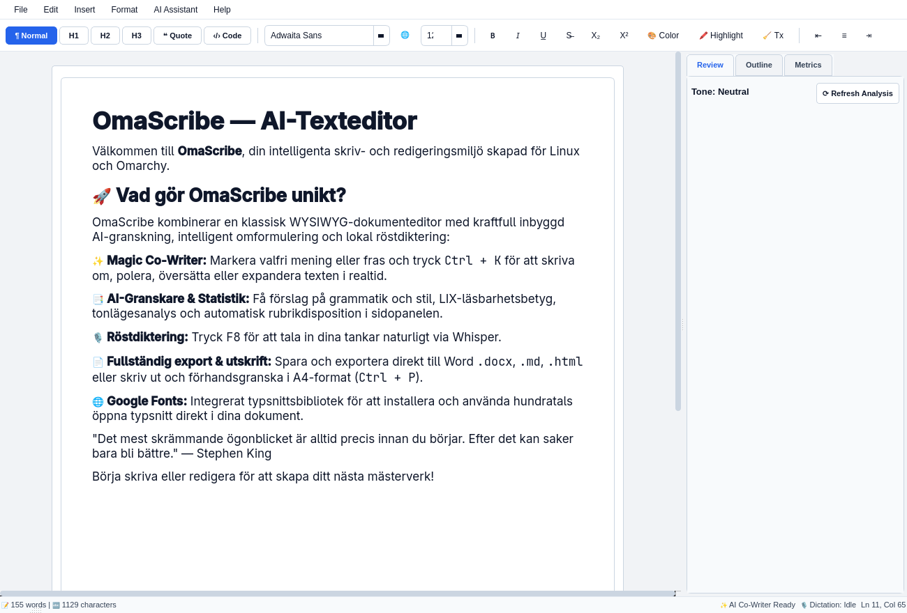

# OmaScribe 📝✨

A powerful, intelligent **AI-Powered Rich Text Word-Like Editor** built with Python, Qt, and real-time DSP/Whisper dictation for Linux & Omarchy.



Featuring A4 document canvas formatting, real-time AI review & style inspection, inline `Ctrl+K` rewriting, local Whisper speech-to-text dictation, and native `.docx`, `.pdf`, `.md`, and `.html` export!

---

## 🎛️ Key Features

* **📄 Full WYSIWYG Rich Text Editor:**
  * Clean A4 page layout with margins, typography, headings (H1–H3), blockquotes, lists, colors, highlights, and alignment.
  * Undo/Redo history stack, Find & Replace, and autosave.

* **✨ Magic Co-Writer (`Ctrl + K`):**
  * Highlight any sentence or paragraph and press `Ctrl + K` to rewrite, make concise, expand, change tone (formal/casual), fix grammar, translate, or format.
  * Preview changes before accepting or inserting below.

* **📑 AI Inspector Sidebar:**
  * **Review & Style:** Readability score (LIX), detected tone, and 1-click apply/dismiss suggestions.
  * **Outline:** Live document headings table of contents with 1-click jump to section.
  * **Metrics:** Real-time word count, character count, and estimated reading time.

* **🎙️ Voice Dictation (`F8`):**
  * Push-to-talk or continuous dictation powered by OpenAI's Whisper model running locally on your machine.

* **🌐 Full Localization (i18n):**
  * Multi-language translation support with clean JSON language files in `locales/` (English `en.json`, Swedish `sv.json`).

* **💾 Versatile Document Export & Import:**
  * Open & Save `.docx` (Microsoft Word), `.pdf` (print-quality vector PDF), `.md` (Markdown), `.html`, and `.txt`.

---

## 🚀 Installation & Launch

```bash
git clone https://github.com/alexwest1981/OmaScribe.git
cd OmaScribe
./install.sh
```

Or run directly with `uv`:
```bash
uv run python main.py
```

---

## 📄 License
MIT License © 2026 [Alex Weström](https://github.com/alexwest1981)
