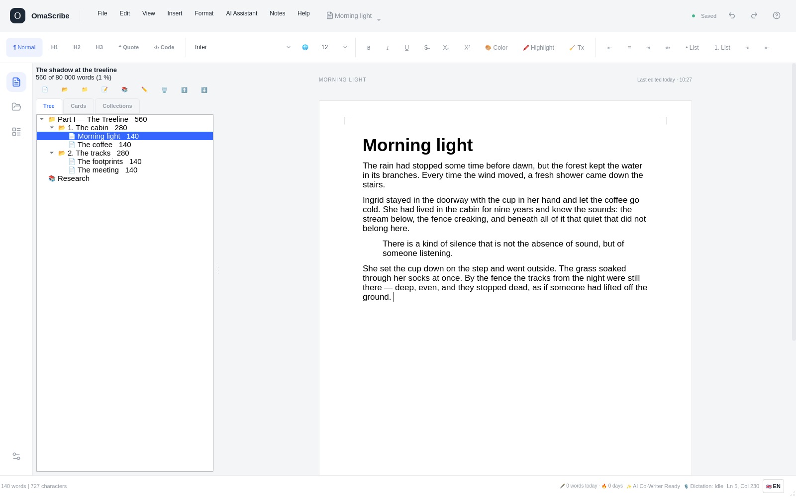
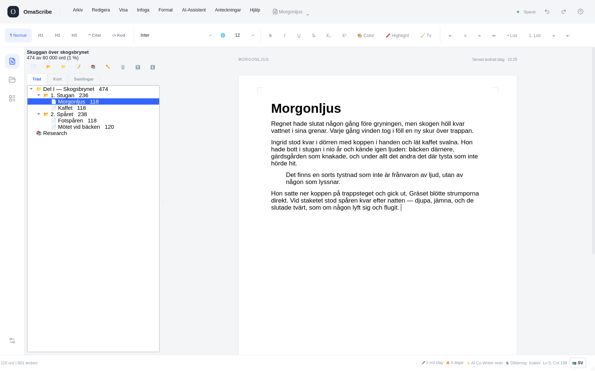

# Skrivstudio

<p align="center">
  <a href="#-english"><b>🇬🇧 English</b></a> &nbsp;•&nbsp; <a href="#-svenska"><b>🇸🇪 Svenska</b></a>
</p>

**A manuscript-first writing suite for Linux.** Structure, story bible, editorial tools
and print-ready exports in one local program — no account, no subscription, no cloud.



*The binder, the A4 page and the inspector. More: [corkboard](docs/images/en/corkboard.png) · [publishing profile](docs/images/en/publish.png).*

---

<a name="-english"></a>
## 🇬🇧 English

### Try it without connecting anything

Everything except the AI features works with no provider, no key and no network. The
AI menu says so instead of sending anything:

```bash
git clone https://github.com/alexwest1981/OmaScribe.git
cd OmaScribe
uv run python main.py          # or: python3 main.py
```

There is no build step and nothing to compile. A fresh config has an empty AI endpoint,
and an empty endpoint means the app tells you nothing was sent rather than picking a
provider for you.

### Install (desktop entry and launcher)

```bash
./install.sh
```

`install.sh` puts a launcher in `~/.local/bin`, an icon and a `.desktop` entry in place,
and uses `uv` for a private environment when `uv` is installed (otherwise your system
`python3`). It refuses to run if document files (`*.docx`, `*.pdf`, `*.odt`, `*.key`,
`*.pem` …) are lying in the project folder — API keys end up in documents people save
next to their code.

| | |
|---|---|
| **OS** | Linux. Built on Omarchy; nothing Omarchy-specific is required. |
| **Python** | 3.11 or newer (`requires-python = ">=3.11"`) |
| **Python packages** | PyQt6 ≥ 6.6, python-docx, markdown, httpx, diff-match-patch, numpy, sounddevice, soundfile, pyphen, lxml |
| **Optional: Ghostscript** | only for PDF/X-1a export. Without it the menu item says so instead of writing a file that claims to be PDF/X. |
| **Optional: faster-whisper** | only for dictation. The model runs locally (`base` by default) and is downloaded on first use. |
| **Optional: EPUBCheck** | only if you want the EPUB validated. Offered as an option, never a requirement. |

`macOS` and `Windows` are **untested** — the app is written for Linux and nothing else
has been tried. Say so rather than expect it to work.

### What it does

**Write.** A WYSIWYG editor on an A4 page with real margins and page breaks
(`Ctrl+Enter`), headings, quotes, lists, colours, highlights, alignment, images with
captions, charts built from an editable data grid, tables (tab-separated text pasted
from a spreadsheet becomes a table), `Ctrl+Z` history, find and replace, autosave.
Typographic elements are semantic roles, not formatting: **scene break** (⁂),
**verse** (indented and italic by the format, so you never double-italicise), and
**message** (SMS/chat blocks) — `Ctrl+Alt+6/7/8`. Page numbers can sit centred, right
or alternating odd/even, top or bottom, as `Page N of M`, `N`, `— N —` or `N / M`, with
running header/footer text and a title page that skips numbering.

**Structure.** A project is a folder: parts, chapters and scenes in a tree, a corkboard
of scene cards, collections (manual groups and saved searches), manuscript *variants* (a
named ordering of scenes), and a scene inspector with synopsis, status, labels, POV and
target. Word counts per scene and for the whole manuscript.

**Story bible.** A codex of characters, places and things with relationships, a
relations graph, an events table that ties events to scenes, per-scene story elements
(Fictionary's questions, as data: what does the POV character want, what stands in the
way), a plot grid, and a names/words generator for when nothing comes.

**Revise.** Snapshots per scene, tracked changes you accept or reject one at a time,
margin comments with threads and *resolved*, compare-and-merge against any earlier
point, and formatting compared separately from the text. An AI suggestion is filed as a
margin comment on its own quote: the manuscript stays byte-identical until you accept,
and accepting costs exactly one undo step.

**Non-fiction.** Footnotes with automatic numbering, cross-references to headings, a
generated table of contents, figure and table captions with lists, paragraph and
character styles, autocorrect and autotext, spell and grammar check per language
section, regex find and replace, blurb and synopsis fields, a writing log, and a
Normseite (standard manuscript page) for submissions that demand one.

**AI — your provider, your key.** Skrivstudio ships with no keys and no provider. Pick
one under the AI menu: OmniRoute, Ollama (offline), DeepSeek, OpenAI, OpenRouter, Nous
Research, Google Gemini, LM Studio/LocalAI — or a custom, self-hosted endpoint. Anything
that speaks the OpenAI chat API works, including a proxy in front of a provider that does
not. A *Test the connection* button tells you whether it answers before you rely on it.
Keys live in your local config, never in the code or the repository.

What the AI can do: rewrite a selection in your voice (`Ctrl+K`), continue a scene
(ghostwriter), review a code block (`Ctrl+Shift+K`), write a paragraph from an
instruction (`Ctrl+Shift+A`), exercises when you are stuck, look-ups that are pulled into
the document, and **Ask the manuscript** (`Ctrl+Shift+Q`) — answers with citations, where
every claim links back to the scene it came from and a click opens that scene.

**Ask the manuscript** is built on a context viewer (*What is sent?*): every part of the
request is listed with its kind, its label, the reason it was included ("the scene you
have open", "mentions the name", "the question points here") and its token count, before
anything is sent. Per codex entry you choose **always / on mention / never**, and the
choice is saved with the book.

**Publish.** A channel profile carrying the channel's own numbers — trim size, paper,
margins and gutter, spine width, cover size (Amazon KDP and others) — each with its
source. *Compile* (Scrivener's idea) exports the whole book or the selection, one file or
one per chapter, with a file-name template and saved profiles. Export: **EPUB 3** with
semantic chapter structure, navigation and accessibility metadata; **DOCX** with named
Word styles; **print PDF** with mirrored margins, hyphenation and dialogue dashes;
**PDF/X-1a:2003** via Ghostscript, verified against the file that was written (not the
intention); **large print** at 1.5× type and leading; **Markdown**, **HTML**, **plain
text**. Prepress finds widows and orphans against the actual page layout and fixes them
in one step. A release folder gets checksums and a pre-flight report, and the cover is
drawn in the channel's exact measurements.

**Clean documents by default.** What leaves the app is paper: white background, black
text, grey rules — no tint from the app theme, from pasted content or from imported
files. A dark theme changes the application around the page, never the page itself.
Charts are greyscale by default, and embedded photos can be converted on export. Toggle
under `File → Page Setup → Clean print & export`; `tools/print_purity_check.py` measures
the contract page by page.

**Reading view.** `Ctrl+Shift+L` merges the scenes into one continuous scroll — read-only
on purpose, so formatting can never land on a hidden scene.

**Two languages.** The whole interface is English and Swedish (1081 strings each), switchable
from the status bar, the start screen or the menu bar.

### Numbers (measured 2026-10-08)

| | |
|---|---|
| Modules | 44 in `core/`, 46 in `ui/` |
| Python | ~35 900 lines in `core/`, `ui/` and `tools/` |
| Interface strings | 1081, in both `locales/en.json` and `locales/sv.json` |
| The gate | `bash tools/test_all.sh` → 741 smoke checks, 54 purity checks, module self-tests, an i18n guard and an ASCII-identifier guard |

The smoke suite drives the real window offscreen and measures pixels where a claim is
visual — for example that `Ctrl+A` paints the selection on *every* paper sheet and not
only the one the editor sits on.

**There is no CI.** The gate is run locally before every commit. That is a weaker promise
than a green badge, so it is written down rather than dressed up.

### Where your data lives, and how to get rid of it

| | |
|---|---|
| Settings and API key | `~/.config/omascribe/config.json` (override with `OMASCRIBE_CONFIG_PATH`) |
| Notes vault | `~/Documents/OmaScribe Vault` by default, changeable |
| Manuscripts | wherever you saved the project folder — a project is a folder you own |
| Dictation models | Whisper's own cache, downloaded on first use |

Delete those and it is gone; nothing is stored anywhere else and nothing is sent
anywhere unless you configure a provider. `install.sh` does not touch your documents,
your config, or the projects you have made. There is no telemetry.

### Known ceilings, said out loud

- **Ask the manuscript retrieves scenes, not passages.** The search is keyword overlap
  between your question and the scenes — not embeddings — and the whole scene is then
  sent. Small on purpose (`# ponytail` in `core/context.py` says when to replace it), and
  the context viewer shows you the consequence before you send anything.
- **Widow and orphan fixing is a heuristic** measured against the current page layout. It
  marks what it changed, and a second pass on changed text is a normal thing to do.
- **Very long single scenes can lag.** Pages are recalculated 120 ms after a change
  instead of on every keystroke; a scene of many tens of pages is the case where you feel
  it. Chapters of ordinary size do not.
- **No text-to-speech.** Reading your manuscript aloud was left out on purpose: it costs
  money per character and the reading view and dictation cover more of the need.
- **Dictation and PDF/X need extra packages** (above). Nothing else does.
- **Word counts never include research material** — notes and research folders live in the
  project but outside the manuscript, so the number you compare against a publisher's
  limit is the manuscript's own.

### Keyboard

| | |
|---|---|
| `Ctrl+K` | Rewrite the selection |
| `Ctrl+Shift+A` | Write a paragraph from an instruction |
| `Ctrl+Shift+K` | Review the code block at the cursor |
| `Ctrl+Shift+Q` | Ask the manuscript |
| `Ctrl+Shift+L` | Reading view |
| `Ctrl+Shift+M` | Format markers across the document |
| `Ctrl+Alt+6/7/8` | Scene break · verse · message |
| `Ctrl+Enter` | Page break |
| `F8` | Dictation |
| `Ctrl+Y` | Redo |
| `Ctrl+Z` | Undo |

### Contributing

`task_plan.md` is the honest state of the work — what is done, what is half-done and
what is left, one line each. Before a change counts as finished:

- `bash tools/test_all.sh` is green. It is the gate: purity checks, the i18n guard, the
  identifier guard, module self-tests and the offscreen smoke suite.
- **Every string is an i18n key** in both `locales/en.json` and `locales/sv.json`.
- **Python identifiers are ASCII.** PyQt6/sip segfaults without a Python traceback when a
  signal is connected to a method whose name contains `å`, `ä` or `ö`;
  `tools/identifier_check.py` refuses that shape. Comments, log lines and error text are
  English.

---

<a name="-svenska"></a>
## 🇸🇪 Svenska

**En manusförst-skrivsvit för Linux.** Struktur, story bible, redaktörsverktyg och
tryckfärdig export i ett och samma lokala program — inget konto, ingen prenumeration,
inget moln.



*Projektvyn, A4-sidan och sidopanelen. Mer: [korttavlan](docs/images/sv/corkboard.png) · [publiceringsprofilen](docs/images/sv/publish.png).*

### Prova utan att koppla upp något

Allt utom AI-funktionerna fungerar utan leverantör, nyckel och nätverk. AI-menyn säger
det i stället för att skicka något:

```bash
git clone https://github.com/alexwest1981/OmaScribe.git
cd OmaScribe
uv run python main.py          # eller: python3 main.py
```

Det finns inget byggsteg. En ny installation har tom AI-slutpunkt, och en tom slutpunkt
betyder att programmet säger att ingenting skickades i stället för att välja leverantör
åt dig.

### Installation (menyikon och startare)

```bash
./install.sh
```

`install.sh` lägger en startare i `~/.local/bin`, en ikon och en `.desktop`-fil, och
använder `uv` för en egen miljö om `uv` finns (annars din `python3`). Den vägrar köra om
dokumentfiler (`*.docx`, `*.pdf`, `*.odt`, `*.key`, `*.pem` …) ligger i projektmappen —
API-nycklar hamnar i dokument som folk sparar bredvid sin kod.

| | |
|---|---|
| **OS** | Linux. Byggt på Omarchy; inget Omarchy-specifikt krävs. |
| **Python** | 3.11 eller nyare |
| **Paket** | PyQt6 ≥ 6.6, python-docx, markdown, httpx, diff-match-patch, numpy, sounddevice, soundfile, pyphen, lxml |
| **Frivilligt: Ghostscript** | bara för PDF/X-1a. Utan det säger menyn det i stället för att skriva en fil som påstår sig vara PDF/X. |
| **Frivilligt: faster-whisper** | bara för diktering. Modellen körs lokalt (`base` som standard) och hämtas vid första användningen. |
| **Frivilligt: EPUBCheck** | bara om du vill validera EPUB:en. Ett val, aldrig ett krav. |

`macOS` och `Windows` är **oprövade** — programmet är skrivet för Linux och inget annat
har försökts.

### Vad programmet gör

**Skriva.** En WYSIWYG-redigerare på en A4-sida med riktiga marginaler och sidbrytningar
(`Ctrl+Enter`), rubriker, citat, listor, färger, överstrykning, justering, bilder med
bildtext, diagram byggda från ett redigerbart datarutnät, tabeller (tabbseparerad text
från ett kalkylark blir en tabell), ångra-historik, sök och ersätt, autosparning.
Typografiska element är semantiska roller, inte formatering: **scenbrytning** (⁂),
**vers** (indragen och kursiv via formatet, så du aldrig dubbelkursiverar) och
**meddelande** (sms/chatt) — `Ctrl+Alt+6/7/8`. Sidnummer kan stå centrerat, till höger
eller växelvis udda/jämna, upptill eller nedtill, som `Sida N av M`, `N`, `— N —` eller
`N / M`, med löpande sidhuvuds- och sidfotstext och en titelsida som hoppar över
numreringen.

**Struktur.** Ett projekt är en mapp: delar, kapitel och scener i ett träd, en korttavla
med sceneskort, samlingar (manuella grupper och sparade sökningar), manus**varianter** (en
namngiven ordning av scener) och en sceninspektör med synopsis, status, etiketter, POV och
mål. Ordantal per scen och för hela manuset.

**Story bible.** Ett codex över personer, platser och ting med relationer, en
relationsgraf, en händelsetabell som knyter händelser till scener, story-element per scen
(Fictionarys frågor som data: vad vill huvudpersonen, vad står i vägen), ett plot-rutnät
och en namn- och ordförrådsgenerator när det tar stopp.

**Revidera.** Ögonblicksbilder per scen, spårade ändringar som du accepterar eller avvisar
en i taget, marginalkommentarer med tråd och *löst*, jämför-och-slå-ihop mot vilken
tidigare punkt som helst, och formateringen jämförd separat från texten. Ett AI-förslag
läggs som marginalkommentar på sitt eget citat: manuset står byte-identiskt tills du
accepterar, och ett accepterat förslag kostar exakt ett ångra-steg.

**Sakprosan.** Fotnoter med automatisk numrering, korsreferenser till rubriker, genererad
innehållsförteckning, bild- och tabelltexter med register, stycke- och teckenstilar,
autokorrigering och autotext, stavnings- och grammatikkontroll per språkavsnitt, sök och
ersätt med reguljära uttryck, fält för blurb och synopsis, skrivlogg och en normsida för
förlag som kräver en.

**AI — din leverantör, din nyckel.** Skrivstudio levereras utan nycklar och utan
leverantör. Välj under AI-menyn: OmniRoute, Ollama (helt offline), DeepSeek, OpenAI,
OpenRouter, Nous Research, Google Gemini, LM Studio/LocalAI — eller en egen, självhostad
slutpunkt. Allt som talar OpenAIs chatt-API fungerar, även en proxyserver framför en
leverantör som inte gör det. Knappen *Testa anslutningen* säger om den svarar innan du
litar på den. Nyckeln ligger i din lokala konfiguration, aldrig i koden eller i repot.

Vad AI:n kan: skriva om en markering i din röst (`Ctrl+K`), skriva vidare en scen
(ghostwriter), granska ett kodblock (`Ctrl+Shift+K`), skriva ett stycke från en
instruktion (`Ctrl+Shift+A`), övningar när det tar stopp, uppslag som dras in i
dokumentet, och **Fråga manuset** (`Ctrl+Shift+Q`) — svar med källhänvisning, där varje
påstående länkar tillbaka till scenen det kom ifrån och ett klick öppnar den.

**Fråga manuset** vilar på en kontextvisare (*Vad skickas?*): varje del av anropet listas
med sitt slag, sin etikett, skälet till att den är med ("scenen du har öppen", "nämner
namnet", "frågan pekar hit") och sin tokenräkning — innan något skickas. Per codexpost
väljer du **alltid / vid omnämning / aldrig**, och valet sparas på boken.

**Publicera.** En kanalprofil med kanalens egna siffror — trim, papper, marginaler och
innermarginal, ryggbredd, omslagsmått (Amazon KDP med flera) — var och en med sin källa.
*Kompilera* (Scriveners idé) exporterar hela boken eller markeringen, en fil eller en per
kapitel, med filnamnsmall och sparade profiler. Export: **EPUB 3** med semantisk
kapitelstruktur, navigering och tillgänglighetsmetadata; **DOCX** med namngivna
Word-stilar; **tryck-PDF** med speglade marginaler, avstavning och repliktankstreck;
**PDF/X-1a:2003** via Ghostscript, verifierad mot filen som skrevs (inte mot avsikten);
**stor stil** med 1,5× grad och radavstånd; **Markdown**, **HTML**, **ren text**.
Tryckförberedelsen hittar änkor och föräldralösa rader mot den verkliga sidlayouten och
åtgärdar dem i ett steg. En släppmapp får checksummor och en förhandskontroll, och
omslaget ritas i kanalens exakta mått.

**Rena dokument som standard.** Det som lämnar programmet är papper: vit botten, svart
text, grå linjer — ingen ton från temat, från inklistrat innehåll eller från importerade
filer. Ett mörkt tema ändrar programmet runt sidan, aldrig sidan själv. Diagram är i
gråskala som standard, och inbäddade foton kan göras gråskaliga vid export. Stängs av
och på under `Arkiv → Sidinställningar → Ren utskrift & export`;
`tools/print_purity_check.py` mäter kontraktet sida för sida.

**Läsvyn.** `Ctrl+Shift+L` fogar ihop scenerna till en sammanhängande rulle — avsiktligt
skrivskyddad, så att formatering aldrig kan landa i en dold scen.

**Två språk.** Hela gränssnittet finns på svenska och engelska (1081 strängar vardera),
växlbart från statusfältet, startsidan eller menyraden.

### Siffror (mätta 2026-10-08)

| | |
|---|---|
| Moduler | 44 i `core/`, 46 i `ui/` |
| Python | ~35 900 rader i `core/`, `ui/` och `tools/` |
| Strängar i gränssnittet | 1081, i både `locales/sv.json` och `locales/en.json` |
| Grinden | `bash tools/test_all.sh` → 741 rökprov, 54 renhetsprov, modulernas självprov, en i18n-vakt och en ASCII-identifierarvakt |

Rökprovet kör det riktiga fönstret i huvudlöst läge och mäter pixlar där påståendet är
visuellt — till exempel att `Ctrl+A` ritar markeringen på *varje* ark och inte bara på
det arket editorn sitter i.

**Det finns ingen CI.** Grinden körs lokalt före varje commit. Det är ett svagare löfte
än en grön bricka, och därför står det här i stället för att kläs upp.

### Var dina data ligger, och hur du blir av med dem

| | |
|---|---|
| Inställningar och API-nyckel | `~/.config/omascribe/config.json` (byt plats med `OMASCRIBE_CONFIG_PATH`) |
| Anteckningsvalv | `~/Documents/OmaScribe Vault` som standard, ändringsbart |
| Manus | där du sparade projektmappen — ett projekt är en mapp du äger |
| Dikteringsmodeller | Whispers egen cache, hämtas vid första användningen |

Radera dem och det är borta; inget sparas någon annanstans och inget skickas någonstans
om du inte själv kopplar in en leverantör. `install.sh` rör inte dina dokument, din
konfiguration eller de projekt du gjort. Ingen telemetri.

### Kända tak, sagt rakt ut

- **Fråga manuset hämtar scener, inte stycken.** Sökningen är nyckelordsöverlapp mellan
  frågan och scenerna — inte embeddings — och sedan skickas hela scenen. Litet med flit
  (`# ponytail` i `core/context.py` säger när det skall bytas), och kontextvisaren visar
  följden innan du skickar något.
- **Änkor och föräldralösa rader åtgärdas med en heuristik** mot den aktuella
  sidlayouten. Den märker vad den ändrade, och en andra genomgång av ändrad text är
  normalt.
- **Enstaka mycket långa scener kan slira.** Sidorna räknas om 120 ms efter en ändring i
  stället för vid varje tangenttryck; en scen på många tiotals sidor är fallet där du
  märker det. Kapitel i vanlig storlek gör det inte.
- **Ingen uppläsning.** Röstsyntes valdes bort med flit: det kostar pengar per tecken,
  och läsvyn och dikteringen täcker behovet bättre.
- **Diktering och PDF/X kräver extra paket** (ovan). Inget annat gör det.
- **Ordantal räknar aldrig in researchmaterial** — anteckningar och researchmappar ligger i
  projektet men utanför manuset, så talet du jämför mot ett förlags gräns är manusets eget.

### Tangentbord

| | |
|---|---|
| `Ctrl+K` | Skriv om markeringen |
| `Ctrl+Shift+A` | Skriv ett stycke från en instruktion |
| `Ctrl+Shift+K` | Granska kodblocket vid markören |
| `Ctrl+Shift+Q` | Fråga manuset |
| `Ctrl+Shift+L` | Läsvyn |
| `Ctrl+Shift+M` | Formatera markeringar i hela dokumentet |
| `Ctrl+Alt+6/7/8` | Scenbrytning · vers · meddelande |
| `Ctrl+Enter` | Sidbrytning |
| `F8` | Diktering |
| `Ctrl+Y` | Gör om |
| `Ctrl+Z` | Ångra |

### Bidra

`task_plan.md` är arbetets ärliga läge — vad som är klart, halvfärdigt och kvar, en rad
var. Innan en ändring räknas som färdig:

- `bash tools/test_all.sh` är grön. Den är grinden: renhetsprov, i18n-vakt,
  identifierarvakt, modulernas självprov och rökprovet i huvudlöst läge.
- **Varje sträng är en i18n-nyckel** i både `locales/sv.json` och `locales/en.json`.
- **Python-identifierare är ASCII.** PyQt6/sip kraschar utan Python-spårning när en signal
  kopplas till en metod med `å`, `ä` eller `ö` i namnet; `tools/identifier_check.py`
  stoppar formen. Kommentarer, loggar och feltexter är engelska.

---

## 🔒 Your keys, your provider

Skrivstudio ships with **no API keys**. Enter your own provider and key under
`AI → Settings` (OmniRoute, Ollama, OpenAI, Anthropic-compatible proxies, OpenRouter,
Gemini, DeepSeek, LM Studio, a local server, or any OpenAI-compatible endpoint). An empty
endpoint means nothing is sent.

Keys are stored in your local config, never in the code. Two rules `install.sh` enforces
for you:

- **Never put document files in the project folder.** API keys end up in `.docx`/`.pdf`
  files people save next to their code. `install.sh` aborts if it finds one, and git, the
  wheel and the sdist all exclude them.
- **Never commit your config or `.env`.** Both are ignored.

## 📄 License

**GNU General Public License v3.0 only** (`GPL-3.0-only`) © 2026 [Alex Weström](https://github.com/alexwest1981).
Full text: [LICENSE](LICENSE).

Skrivstudio **can't** be MIT or Apache, and the reason is in the dependency list: the
program links [PyQt6](https://riverbankcomputing.com/software/pyqt/), which Riverbank
distributes under the GPL v3 *only* (or a commercial licence). A work that links it must
therefore be GPL v3 as well.

That suits the project: the licence is **copyleft**. Anyone may run, study, change and
share this code — including for money, and including for free. What they may not do is turn
a modified version into closed source: a work based on it must carry prominent notices that
it was modified (GPL v3 §5a), keep the copyright and licence notices intact (§4, §5b), be
licensed as a whole under the same licence (§5c), and — since the app has an interactive
interface — display its legal notices (§5d, which is what `Help → About` does).

There is no warranty of any kind (§15–17).

**The licence covers the code, not the name.** The copyright above grants you the source
under the GPL; the product's name and mark are a separate thing. A fork is welcome to
carry Skrivstudio's code — with its own name and its own icon. This is a notice, not a
registration: a registered trademark is what could compel a rename, and no such
registration exists.
